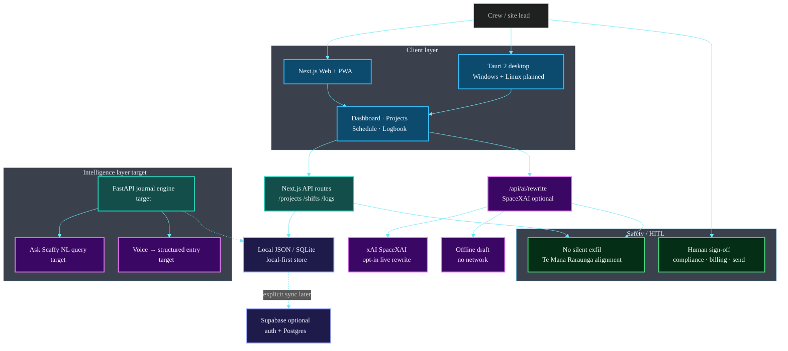
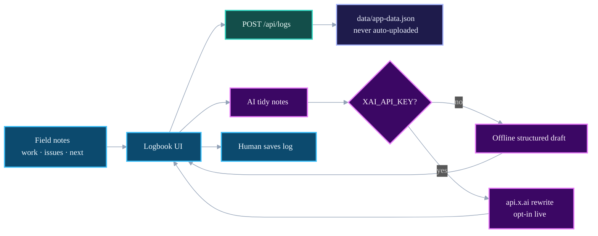

# ScaffyLads Architecture

## Overview

ScaffyLads is a sovereign, offline-capable AI work journal for scaffolding and construction crews in Aotearoa New Zealand.

It prioritises local-first data, voice + natural language interaction, and clean compliance records.

**This document is the source of truth.** Every future build (including Grok Build sessions) must stay congruent with these decisions.

> **Diagrams:** Architecture images and Mermaid maps describe the **target product architecture** for this pre-seed product. They are engineering design maps, not claims of large-scale commercial fleet deployment.


## Core Principles (Non-negotiable)

1. **Local-first / Offline-first** – Journal entries live on device first. Sync is optional and explicit.
2. **Data Sovereignty** – User and crew data under owner control. Prefer NZ residency for any cloud components.
3. **Voice + Natural Language** – Capture and query by speaking or typing plain English (“Ask Scaffy”).
4. **Progressive Enhancement** – Core logging works fully offline. Cloud features layer on top.
5. **Congruence with Front_Line_Whanau** – Reuse design patterns, Tauri packaging approach, and engineering discipline.
6. **HITL for high-stakes** – Compliance templates, billing, and production data changes require human approval.

## System map (target)



## Data flow — log entry + AI tidy



## High-Level Architecture (ASCII)

```
┌─────────────────────────────────────────────────────────────┐
│                     Client Layer                            │
│  Next.js (Web + PWA)  +  Tauri 2 (Windows / Linux Desktop)  │
│  Tailwind + Ultra Glassmorphism UI                          │
└────────────────────────────┬────────────────────────────────┘
                             │ HTTPS or local sidecar
┌────────────────────────────▼────────────────────────────────┐
│                  FastAPI Intelligent Layer                  │
│  • Journal CRUD                                             │
│  • Voice → structured entry                                 │
│  • Natural language query engine (“Ask Scaffy”)             │
│  • Report & compliance helpers                              │
│  • Optional local LLM / RAG                                 │
└────────────────────────────┬────────────────────────────────┘
                             │
              ┌──────────────┼──────────────┐
              ▼              ▼              ▼
        Local SQLite    Supabase       Future
        (Tauri /        (Auth +        Edge nodes
         browser)        Postgres +     (CAT stack)
                         Storage)
```

## Current State vs Target

| Layer              | Current (Grok Build)      | Target                                      |
|--------------------|---------------------------|---------------------------------------------|
| Frontend           | Next.js + Tailwind        | Keep + glassmorphism + Tauri                |
| Data               | JSON file                 | Local-first SQLite → optional Supabase      |
| Intelligence       | Simple AI rewrite         | FastAPI + full NL query engine              |
| Desktop            | None                      | Tauri 2                                     |
| Docs               | README + this file        | ARCHITECTURE + AGENTS + CAT_CONGRUENCE      |

## Data Model (Core)

### Implemented today (JSON store)

| Entity | Purpose |
|--------|---------|
| **Project** | Job site, client, status, notes |
| **Shift** | Roster entry linked to a project |
| **LogEntry** | Daily notebook: weather, height, inspection, work / issues / next steps |

### Target journal model (expansion)

**JournalEntry**
- id, user_id / crew_id
- date, site_address, gps (optional)
- client_or_builder
- description / scope_of_work
- workers_count
- ordinary_hours, overtime_hours
- travel_km
- compliance_notes (inspections, tags, defects, weather)
- photos[]
- raw_voice_transcript (optional)
- created_at, updated_at, device_id, sync_status

## Subscription Tiers

- **Free** → Local only, limited entries
- **Pro** → Unlimited personal + full voice + natural language
- **Crew** → Shared space + roles (up to 6)
- **Business** → Multi-crew, branding, API, priority support

## Standards for Every Build

- Prefer patterns already proven in Front_Line_Whanau
- Python for the intelligent layer
- TypeScript for the shell
- Explicit HITL on high-stakes changes
- No silent data exfiltration
- Keep this ARCHITECTURE.md updated when decisions change
