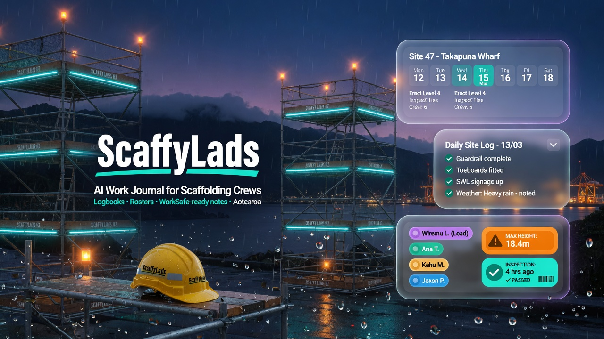
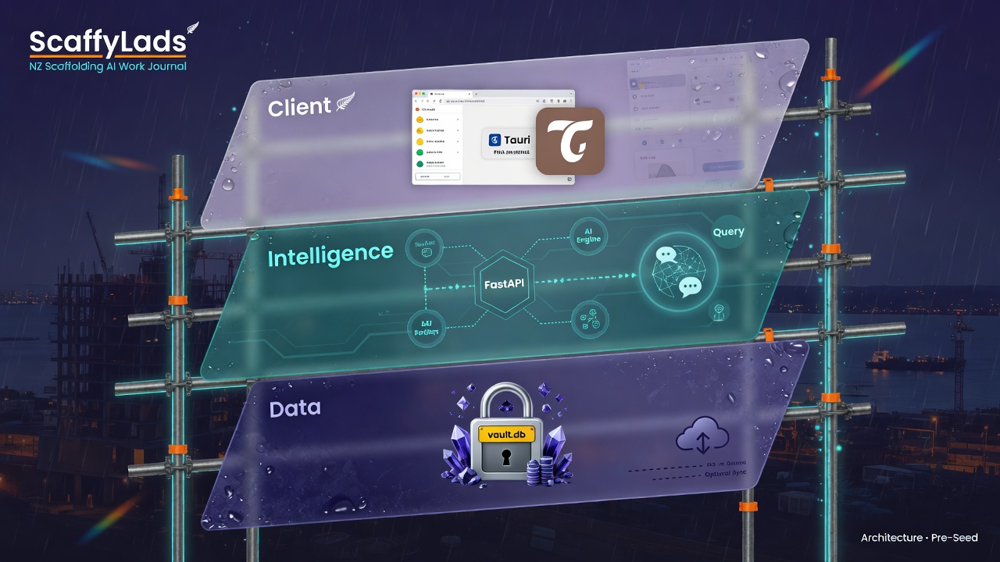
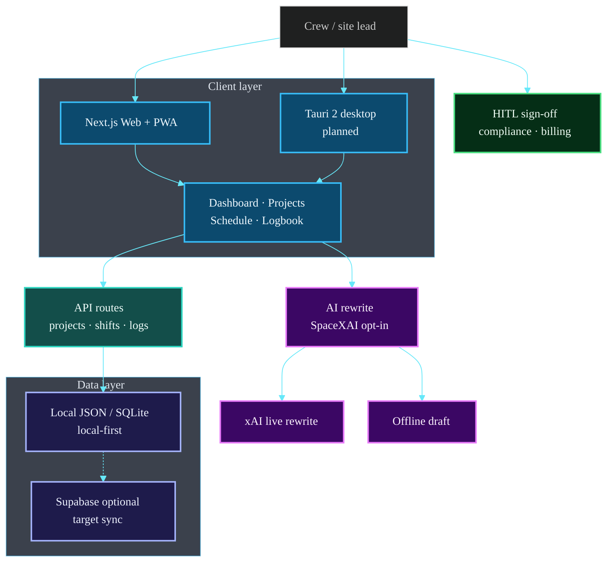
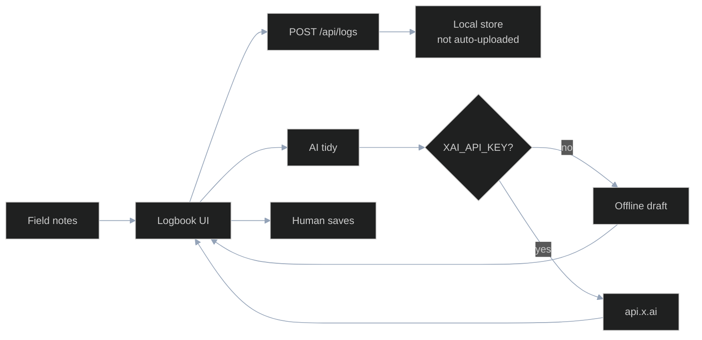

# ScaffyLads

<!-- BEGIN CAT_CONGRUENCE_SNIPPET -->
## Coastal Alpine Tech portfolio

[](https://github.com/fivepanelhat/fivepanelhat)
[](https://scaffylads.vercel.app)
[](./ROADMAP.md)
[](./ARCHITECTURE.md)
[](./AGENTS.md)
[](./COMPLIANCE.md)
[](./COMPLIANCE.md)
[](./ROADMAP.md)
[](https://github.com/fivepanelhat/scaffylads/actions/workflows/ci.yml)
[](https://github.com/fivepanelhat/scaffylads/actions/workflows/ci-scan.yml)
[](https://github.com/fivepanelhat/scaffylads/actions/workflows/secops.yml)
[](https://github.com/fivepanelhat/scaffylads/actions/workflows/redteam.yml)

**Part of the [Kiwi Edge AI Stack](https://github.com/fivepanelhat/fivepanelhat)** · Org: [fivepanelhat](https://github.com/fivepanelhat) · Live: [scaffylads.vercel.app](https://scaffylads.vercel.app)

> Sovereign work journal for NZ scaffolding crews — local-first capture, multimodal notes, Ask Scaffy NL, Te Mana Raraunga aligned. FastAPI / SQLite / Tauri are **roadmap**, not live ([ROADMAP.md](./ROADMAP.md)).

**Agents inform, draft, prepare, and remind. Humans save, sign, file, send, and pay.**  
Congruence: [`CAT_CONGRUENCE.md`](./CAT_CONGRUENCE.md) · Compliance: [`COMPLIANCE.md`](./COMPLIANCE.md) · Agents: [`AGENTS.md`](./AGENTS.md)
<!-- END CAT_CONGRUENCE_SNIPPET -->



---

### What is ScaffyLads?

ScaffyLads is a cross-platform AI-powered work journal purpose-built for scaffolding and construction professionals in Aotearoa New Zealand.

Capture the day by **text, paste, voice, or file note**. Then ask questions in plain English (**Ask Scaffy**):

- *“Travel kms for the last two job sites”*
- *“How many days did I work in Palmerston North this year?”*
- *“Overtime hours so far for [builder]”*
- *“Show compliance notes for the [site] scaffold”*

Live product: **https://scaffylads.vercel.app** · Mission / 5 W’s: `/mission` · Ask: `/ask`

## The 5 W's

| W | Answer |
| --- | --- |
| **Who** | Sole traders & small scaffolding crews (site leads, board hands) across Aotearoa |
| **What** | AI-native work journal + roster: multimodal capture, NL query, WorkSafe-minded logs |
| **Why** | Notes die in vans & chats; kms/OT/inspections vanish when claims come due |
| **When** | Live MVP now; SQLite / FastAPI / Tauri are roadmap ticks ([ROADMAP.md](./ROADMAP.md)) |
| **Where** | Web/PWA nationwide NZ; local-first; optional Supabase Sydney |

## Problems → solution

**Problems:** fragmented capture, compliance drag, admin after dark, data that walks away, no way to ask the past.

**Solution:** projects · shifts · logbook dual-store; multimodal capture; Ask Scaffy NL; HITL + Te Mana Raraunga alignment (see [COMPLIANCE.md](./COMPLIANCE.md), [CAT_CONGRUENCE.md](./CAT_CONGRUENCE.md)).

### Core stack (shipped now)

| Layer | Technology | Purpose |
|-------|------------|---------|
| Frontend | Next.js + React + TypeScript | Web app (Vercel) |
| Styling | Tailwind + CAT dark glass UI | High-clarity site UI |
| API / AI | Next.js route handlers + SpaceXAI opt-in | CRUD, Ask Scaffy, AI tidy |
| Data | Local JSON dual-store → optional Supabase Sydney | Local-first + production DB |

**Roadmap (not live):** SQLite local vault · FastAPI Python engine · Tauri desktop · full PWA offline · blob attachments.  
Tick progress in **[ROADMAP.md](./ROADMAP.md)** — no fixed dates, just checkboxes as work lands.

## Architecture Overview

> **Diagrams:** Architecture images and Mermaid maps describe the **target product architecture** for this pre-seed product. They are engineering design maps, not claims of large-scale commercial fleet deployment.



### System map



### Log + AI tidy flow



Full detail: **[ARCHITECTURE.md](./ARCHITECTURE.md)**

### 4-Tier Subscription

- **Free** – Limited entries, basic logging
- **Pro** – Unlimited personal + full voice + natural language
- **Crew** – Shared team journals
- **Business** – Unlimited seats, branding, integrations

### Key Documents

- [ARCHITECTURE.md](./ARCHITECTURE.md) – Source of truth
- [AGENTS.md](./AGENTS.md) – Rules for Grok Build & agents
- [CAT_CONGRUENCE.md](./CAT_CONGRUENCE.md) – Coastal Alpine Tech alignment

### Quick Start

```bash
cp .env.example .env.local
# Optional: fill Supabase + XAI keys (see below)
npm install
npm run dev
```

### Checks

```bash
npm run type-check   # tsc --noEmit
npm run lint         # eslint
npm test             # vitest
npm run build        # production build
```

CI runs all four on every push and pull request.

### Supabase (production store)

Sydney project **scaffylads** (`ivprttslhudjoatsrsma`). Schema lives in
`supabase/migrations/`. Dual-mode store:

| Mode | When | Backend |
| --- | --- | --- |
| **JSON** | Supabase env unset | `data/app-data.json` (local demo) |
| **Supabase** | `NEXT_PUBLIC_SUPABASE_URL` + service/anon key set | Postgres tables `projects`, `shifts`, `logs` |

```bash
# Link + push migrations (already applied on the shared project)
npx supabase link --project-ref ivprttslhudjoatsrsma
npx supabase db push
```

Env (see `.env.example`):

- `NEXT_PUBLIC_SUPABASE_URL`
- `NEXT_PUBLIC_SUPABASE_ANON_KEY`
- `SUPABASE_SERVICE_ROLE_KEY` (server only — preferred for demo CRUD)

### Vercel

Production project: **scaffylads** on team `fivepanelhat-5998s-projects`.

Production alias: https://scaffylads-fivepanelhat-5998s-projects.vercel.app

Set these in **Project → Settings → Environment Variables** (Production + Preview):

| Name | Notes |
| --- | --- |
| `NEXT_PUBLIC_SUPABASE_URL` | `https://ivprttslhudjoatsrsma.supabase.co` |
| `NEXT_PUBLIC_SUPABASE_ANON_KEY` | from Supabase API settings |
| `SUPABASE_SERVICE_ROLE_KEY` | server only, never expose to browser |
| `XAI_API_KEY` | optional live AI rewrite |
| `XAI_MODEL` | optional, default `grok-4.5` |

Then redeploy so the dual-store uses Supabase instead of empty local JSON.

CLI (once logged in):

```bash
npx vercel link --project scaffylads
npx vercel env pull .env.local
npx vercel --prod
```

### Where your data goes

**Local (no Supabase env):** journal data is in `data/app-data.json` (gitignored).
It is never uploaded on save.

**With Supabase env:** projects / shifts / logs are stored in the Sydney Supabase project.

The one exception is **AI tidy notes**:

| Mode | When | What leaves the device |
| --- | --- | --- |
| **Offline** (default) | No `XAI_API_KEY` set | Nothing. The draft is assembled locally. |
| **Live** | `XAI_API_KEY` is set | The work / issues / next-steps text is sent to `api.x.ai` (xAI, US) to be rewritten. |

Live mode is opt-in by the operator setting a key, and the logbook labels which
mode produced each draft. Per [CAT_CONGRUENCE.md](./CAT_CONGRUENCE.md) rule 1
and [AGENTS.md](./AGENTS.md) rule 6, nothing should leave the device without the
crew knowing — if you enable live mode, make sure that is the intent for the
journal content in question.

## License

Proprietary — © 2026 Coastal Alpine Tech Limited. All rights reserved. No
open-source grant is implied by access to this repository; see [LICENSE](./LICENSE).

Built with care for the lads on the tools.  
Coastal Alpine Tech • Taranaki / Aotearoa
