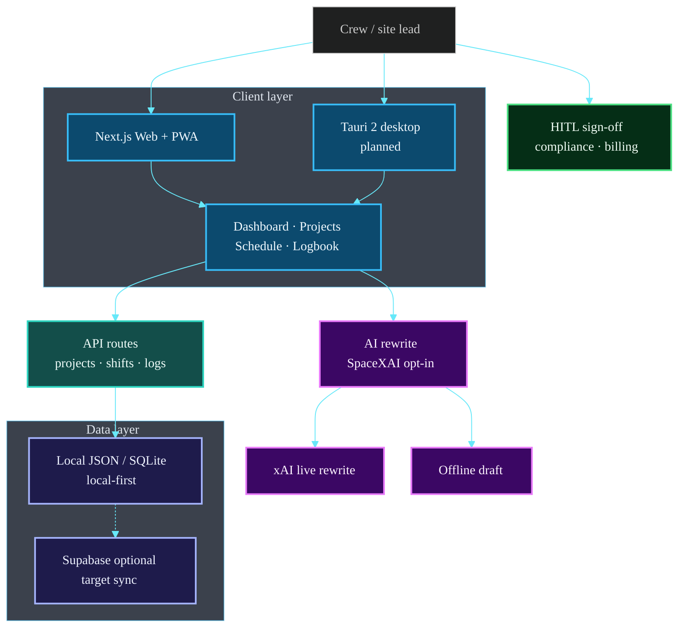
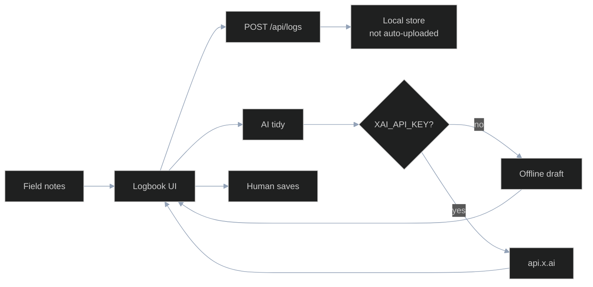

# ScaffyLads


---

### What is ScaffyLads?

ScaffyLads is a cross-platform AI-powered work journal purpose-built for scaffolding and construction professionals in Aotearoa New Zealand.

Capture the day by typing or speaking. Then ask questions in plain English:

- *“Travel kms for the last two job sites”*
- *“How many days did I work in Palmerston North this year?”*
- *“Overtime hours so far for [builder]”*
- *“Show compliance notes for the [site] scaffold”*

### Core Stack

| Layer | Technology | Purpose |
|-------|------------|---------|
| Frontend | Next.js + React + TypeScript | Web + PWA |
| Desktop | Tauri 2 (planned) | Windows + Linux |
| Styling | Tailwind + Ultra Glassmorphism | Modern high-clarity UI |
| Backend / AI | FastAPI (Python) | Journal engine + NL queries |
| Data | Local-first → optional Supabase | Offline capable + sync |

## Architecture Overview

> **Diagrams:** Architecture images and Mermaid maps describe the **target product architecture** for this pre-seed product. They are engineering design maps, not claims of large-scale commercial fleet deployment.


### System map



### Log + AI tidy flow



Full detail: **[ARCHITECTURE.md](./ARCHITECTURE.md)**

### 4-Tier Subscription

- **Free** – Limited entries, basic logging
- **Pro** – Unlimited personal + full voice + natural language
- **Crew** – Shared team journals
- **Business** – Unlimited seats, branding, integrations

### Key Documents

- [ARCHITECTURE.md](./ARCHITECTURE.md) – Source of truth
- [AGENTS.md](./AGENTS.md) – Rules for Grok Build & agents
- [CAT_CONGRUENCE.md](./CAT_CONGRUENCE.md) – Coastal Alpine Tech alignment

### Quick Start

```bash
npm install
npm run dev
```

### Checks

```bash
npm run type-check   # tsc --noEmit
npm run lint         # eslint
npm test             # vitest
npm run build        # production build
```

CI runs all four on every push and pull request.

### Where your data goes

Journal data is held in a local JSON store (`data/app-data.json`, gitignored).
It is never uploaded on save.

The one exception is **AI tidy notes**:

| Mode | When | What leaves the device |
| --- | --- | --- |
| **Offline** (default) | No `XAI_API_KEY` set | Nothing. The draft is assembled locally. |
| **Live** | `XAI_API_KEY` is set | The work / issues / next-steps text is sent to `api.x.ai` (xAI, US) to be rewritten. |

Live mode is opt-in by the operator setting a key, and the logbook labels which
mode produced each draft. Per [CAT_CONGRUENCE.md](./CAT_CONGRUENCE.md) rule 1
and [AGENTS.md](./AGENTS.md) rule 6, nothing should leave the device without the
crew knowing — if you enable live mode, make sure that is the intent for the
journal content in question.

Built with care for the lads on the tools.  
Coastal Alpine Tech • Taranaki / Aotearoa
